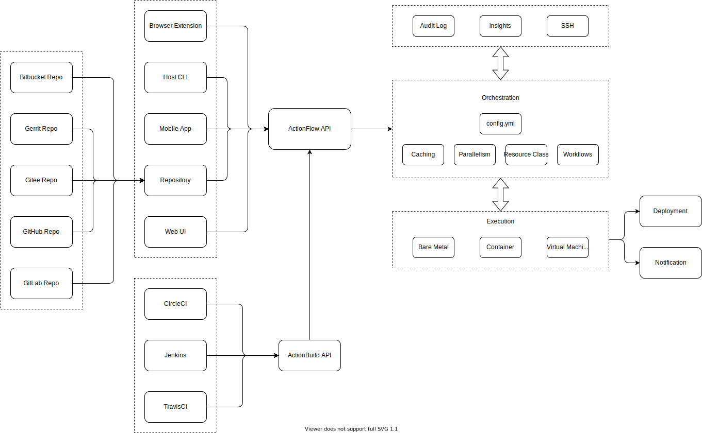

# actionflow

[](https://github.com/craftslab/actionflow/actions?query=workflow%3ACI)
[](https://goreportcard.com/report/github.com/craftslab/actionflow)
[](https://github.com/craftslab/actionflow/blob/master/LICENSE)
[](https://github.com/craftslab/actionflow/tags)


## Introduction

*Action Flow* is a pipeline action server written in Go.

See *[Action View](https://github.com/craftslab/actionview/)* as a view of *Action Flow*.


## Requirement

- Gin >= 1.6.0
- Go >= 1.15.0


## Running

```bash
git clone https://github.com/craftslab/actionflow.git

cd actionflow
make build

./bin/actionflow --addr="localhost:9090"
```


## Usage

```bash
usage: actionflow [<flags>]

Action Flow

Flags:
  --help          Show context-sensitive help (also try --help-long and --help-man).
  --version       Show application version.
  --addr=":9090"  Server listen address
```


## Design




## License

Project License can be found [here](LICENSE).


## Reference

- [Concourse](https://concourse-ci.org)
- [Cycloid](https://cycloid.io)
- [Terraform](https://www.terraform.io)
